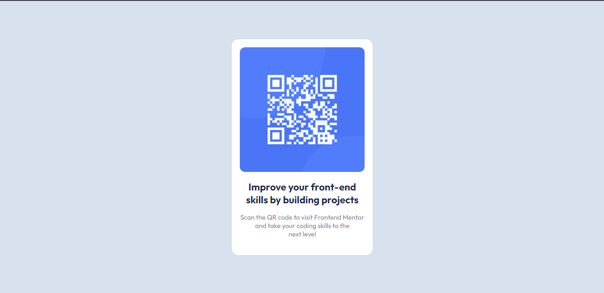

# Frontend Mentor - QR code component solution 

## Table of contents

- [Built with](Flexbox)
- [What I learned](#flexbox)
- [Useful resources](#margin,padding,flexbox)
- [Author](#Haarthurr)
- [Acknowledgments](#flexbox)

### Built with

- Semantic HTML5 markup
- CSS custom properties
- Flexbox

### What I learned

flexbox.
And Basic CSS.

## Autor

Discord: [Haarthurr#6313]
- GutHub - [haarthurr](https://github.com/haarthurr)